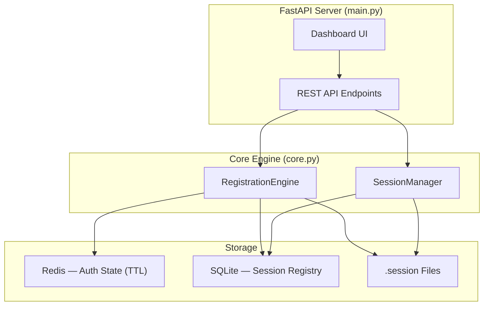
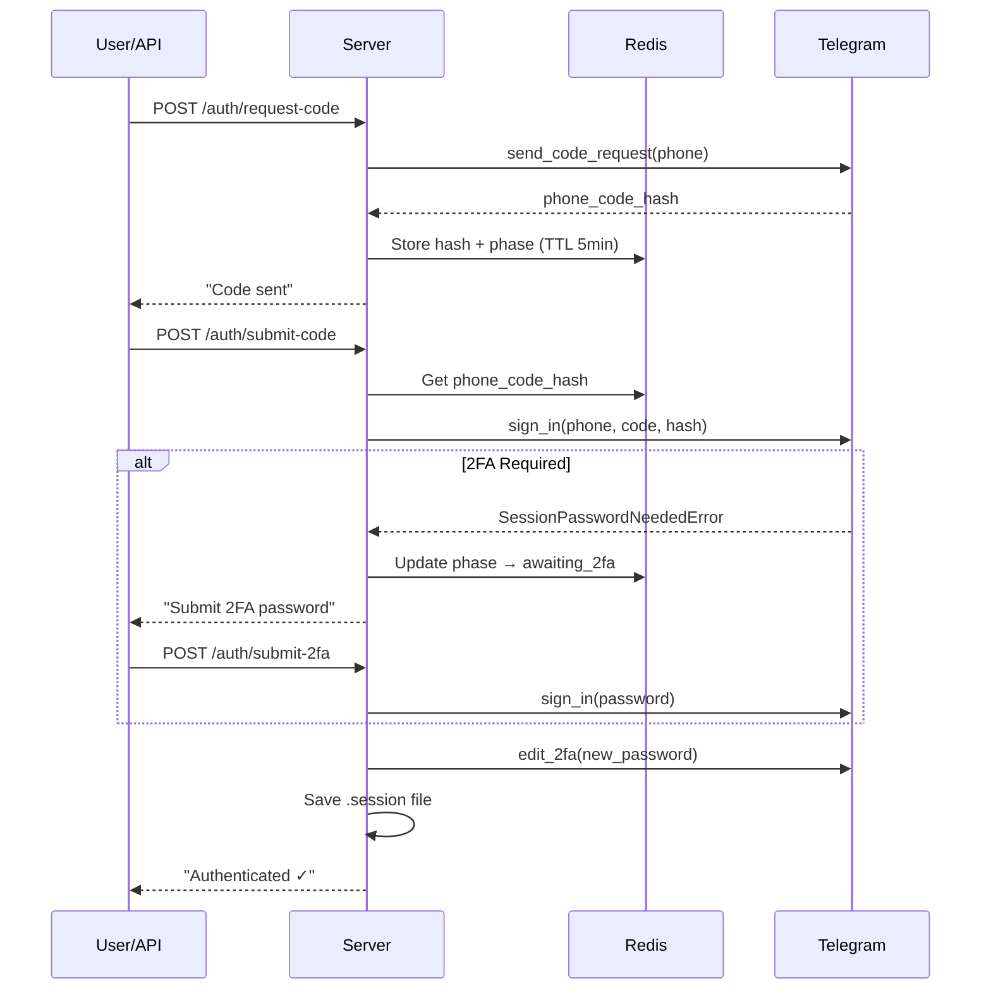

# Telegram Multi-Session Manager — Project Walkthrough

## Project Structure

```
a:\camoufox-scripts\telegram\
├── config.py          # Environment config + device spoofing profile
├── schema.py          # Pydantic models + SQLite session registry
├── core.py            # Telethon engine (auth + session management)
├── main.py            # FastAPI server + API endpoints
├── dashboard.html     # Management UI (dark theme, 4-tab layout)
├── requirements.txt   # Python dependencies
├── .env               # Your API credentials (edit this!)
└── .env.example       # Template
```

## Architecture



## Device Identity Profile

All sessions appear as:
| Field | Value |
|-------|-------|
| Device | Dell Latitude E4300 |
| OS | Windows 10 |
| App | Telegram Desktop 5.1.4 x64 |
| Language | en / en-US |

## API Endpoints

### Module A — Registration

| Method | Endpoint | Body | Description |
|--------|----------|------|-------------|
| `POST` | `/auth/request-code` | `{ "phone": "+1234567890" }` | Sends login code to phone |
| `POST` | `/auth/submit-code` | `{ "phone": "...", "code": "12345" }` | Verifies the login code |
| `POST` | `/auth/submit-2fa` | `{ "phone": "...", "password": "..." }` | Submits 2FA password |

### Module B — Session Management

| Method | Endpoint | Description |
|--------|----------|-------------|
| `GET` | `/sessions` | List all sessions with live status |
| `POST` | `/messages/get` | Fetch messages from a chat |
| `POST` | `/messages/search` | Search keyword across chats |
| `POST` | `/monitor/start` | Start live message listener |
| `POST` | `/monitor/stop` | Stop listener |
| `DELETE` | `/sessions/{phone}` | Terminate & delete session |

## Auth Flow (4 Phases)



## Setup Instructions

### 1. Configure credentials
Edit `.env` with your Telegram API credentials from [my.telegram.org](https://my.telegram.org):

```env
API_ID=12345678
API_HASH=your_api_hash_here
DEFAULT_2FA_PASSWORD=YourStrong2FAPassword!
```

### 2. Start Redis
```bash
# Windows (via Docker)
docker run -d -p 6379:6379 redis:alpine

# Or install Redis for Windows
```

### 3. Run the server
```bash
python main.py
```

### 4. Open dashboard
Navigate to `http://localhost:8000` — the management UI has 4 tabs:
- **Registration** — Auth flow with live log
- **Sessions** — View/manage all sessions
- **Messages** — Fetch & search messages
- **Monitor** — Live incoming message feed

> [!IMPORTANT]
> You **must** edit `.env` with real `API_ID` and `API_HASH` before starting. Redis must be running on `localhost:6379`.

> [!WARNING]
> The `DEFAULT_2FA_PASSWORD` is automatically set on every newly registered account. Change it to something strong before production use.
